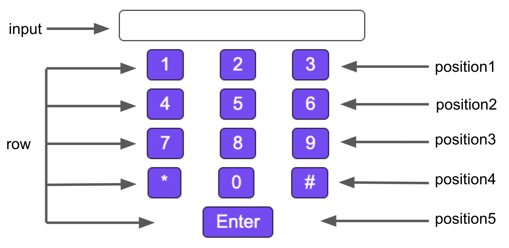
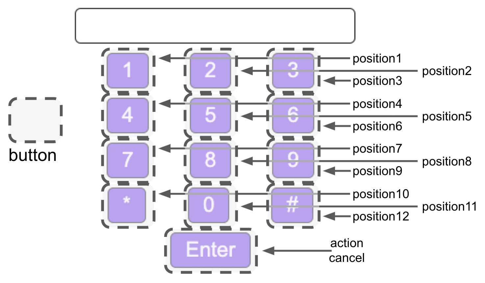

# \<vc-keypad>

This Web Component follows the [open-wc](https://github.com/open-wc/open-wc) recommendation and created to interact with the [Vonage Client SDK](https://developer.nexmo.com/client-sdk/overview).

For more information about the keypad component, please see the following blog post:
* [Creating a Web Component With Open-WC](https://learn.vonage.com/blog/2020/08/13/creating-a-web-component-with-open-wc/)
* [Using Web Components in a React Application](https://learn.vonage.com/blog/2020/10/07/using-web-components-in-a-react-application-dr/)
* [Use Web Components in Vue 2 and 3 + Composition API](https://learn.vonage.com/blog/2020/10/30/use-web-components-in-vue-2-and-3-composition-api-dr/)
* [Using Web Components in an Angular application: Joyful & Fun](https://learn.vonage.com/blog/2021/02/16/using-web-components-in-an-angular-application-joyful-fun/)

## Installation
```bash
npm i @vonage/vc-keypad
```

## Usage
```html
<script type="module">
  import '@vonage/vc-keypad/vc-keypad.js';
</script>

<vc-keypad></vc-keypad>

// with some attributes added
<vc-keypad no-display keys='["","▲","","◀","","▶","","▼","","","",""]' actionText="💥 Pew"></vc-keypad>
```

Attributes that can be used (optional):

- `no-asterisk` : hide the * button
- `no-hash` : hide the # button
- `no-display` : hide the input display
- `actionText="custom text"` : customize the text on the start action button
- `cancelText="custom text"` : customize the text on the cancel action button
- `keys='["1","2"..."#"]'` : customize the text that shows on the keypad buttons
- `placeholder="custom text"` : customize the input display's placeholder text 

Events to listen for

- `digit-added` : fired when a digit is added, payload contains the digit and it's position
- `digits-sent` : fired when digit(s) are submitted, payload contains the digit(s)
- `action-ended` : fired when an action is cancelled / ended

Methods that can be called

- `createAction()` : let the component know the action has started, will show the cancel button and hide the action button
- `cancelAction()` : let the component know the action has be cancelled, will clear the input display and show the action button and hide the cancel button

## Styling
The `vc-keypad` component uses [CSS part](https://developer.mozilla.org/en-US/docs/Web/CSS/::part) to apply custom styles.

Here are two diagram that labels the parts of the component as well as the default style:



To style the input display, the part is "input".

Each row is labeled as "row". To style a specific row, the parts are labeled as "position1 position2 ... position5", i.e. "row position4".



To apply a style to all buttons, target the part "button". Each button can be styled individually by adding its part "position1 position2 ... action cancel", i.e. "button position11".

Example:

```css
vc-keypad::part(row position4) {
  color: red;
  border: 2px green solid;
  font-size: 30px;
  display: none;
}

vc-keypad::part(button) {
  border-radius: 100%;
  width: 60px;
  height: 60px;
  background-color: black;
}

vc-keypad::part(button action) {
  border-radius: 6px;
  width: 100%;
  background-color: red;
}

vc-keypad::part(button position1) {
  display: none;
}

vc-keypad::part(button position3) {
  display: none;
}

vc-keypad::part(button position5) {
  display: none;
}

vc-keypad::part(button position7) {
  display: none;
}

vc-keypad::part(button position9) {
  display: none;
}
```

## Linting with ESLint, Prettier, and Types
To scan the project for linting errors, run
```bash
npm run lint
```

You can lint with ESLint and Prettier individually as well
```bash
npm run lint:eslint
```
```bash
npm run lint:prettier
```

To automatically fix many linting errors, run
```bash
npm run format
```

You can format using ESLint and Prettier individually as well
```bash
npm run format:eslint
```
```bash
npm run format:prettier
```

## Testing with Web Test Runner
To run the suite of Web Test Runner tests, run
```bash
npm run test
```

To run the tests in watch mode (for &lt;abbr title=&#34;test driven development&#34;&gt;TDD&lt;/abbr&gt;, for example), run

```bash
npm run test:watch
```

## Demoing with Storybook
To run a local instance of Storybook for your component, run
```bash
npm run storybook
```

To build a production version of Storybook, run
```bash
npm run storybook:build
```


## Tooling configs

For most of the tools, the configuration is in the `package.json` to reduce the amount of files in your project.

If you customize the configuration a lot, you can consider moving them to individual files.

## Local Demo with `web-dev-server`
```bash
npm start
```
To run a local development server that serves the basic demo located in `demo/index.html`
