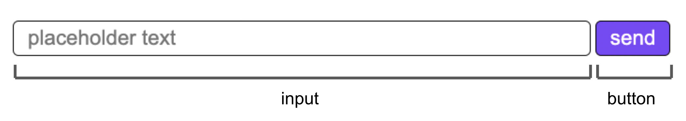

# \<vc-text-input>

This Web Component follows the [open-wc](https://github.com/open-wc/open-wc) recommendation and is meant to be used with the [Vonage Client SDK In-App Messaging](https://developer.nexmo.com/client-sdk/in-app-messaging/overview).

A goal is to simplify the code needed to create a chat room quickly. Please see the Creating a chat app [tutorial](https://developer.nexmo.com/client-sdk/tutorials/in-app-messaging/introduction/javascript) to see an implementation using Vanilla JavaScript.

This Web Component can be used to replace a part of the Chat app UI.

## Installation
```bash
npm i @vonage/vc-text-input
```

## Usage
```html
<script type="module">
  import '@vonage/vc-text-input/vc-text-input.js';
</script>

<vc-text-input></vc-text-input>
// to set the placeholder and/or button with your own text
<vc-text-input placeholder="your placeholder text"  buttonText="enter"></vc-text-input>
```
The `vc-text-input` Web Component can handle all its responsibilities in a Conversation.

First, get a reference to the element:
```js
const vcTextInput = document.querySelector("vc-text-input");
```

Then, pass the Conversation object to the Web Component:
```js
vcTextInput.conversation = conversation;
```
> **Note:** To see where `conversation` came from, see step 10 in the [tutorial](https://developer.nexmo.com/client-sdk/tutorials/in-app-messaging/client-sdk/in-app-messaging/join-conversation/javascript).

## Styling
The `vc-text-input` component uses [CSS part](https://developer.mozilla.org/en-US/docs/Web/CSS/::part) to apply custom styles.

Here is a diagram that labels the parts of the component as well as the default style:


To style the input element, the part is "input". For the button element, the part is "button".

Example:
```css
vc-text-input::part(button) {
  color: red;
  border: 2px green solid;
  font-size: 30px;
  background-color: transparent;
}

vc-text-input::part(input) {
  color: red;
  border-radius: 0px;
  border: 4px blue dotted;
  background-color: yellow;
}
```

## Linting with ESLint, Prettier, and Types
To scan the project for linting errors, run
```bash
npm run lint
```

You can lint with ESLint and Prettier individually as well
```bash
npm run lint:eslint
```
```bash
npm run lint:prettier
```

To automatically fix many linting errors, run
```bash
npm run format
```

You can format using ESLint and Prettier individually as well
```bash
npm run format:eslint
```
```bash
npm run format:prettier
```

## Testing with Web Test Runner
To run the suite of Web Test Runner tests, run
```bash
npm run test
```

To run the tests in watch mode (for &lt;abbr title=&#34;test driven development&#34;&gt;TDD&lt;/abbr&gt;, for example), run

```bash
npm run test:watch
```

## Demoing with Storybook
To run a local instance of Storybook for your component, run
```bash
npm run storybook
```

To build a production version of Storybook, run
```bash
npm run storybook:build
```


## Tooling configs

For most of the tools, the configuration is in the `package.json` to reduce the amount of files in your project.

If you customize the configuration a lot, you can consider moving them to individual files.

## Local Demo with `web-dev-server`
```bash
npm start
```
To run a local development server that serves the basic demo located in `demo/index.html`
